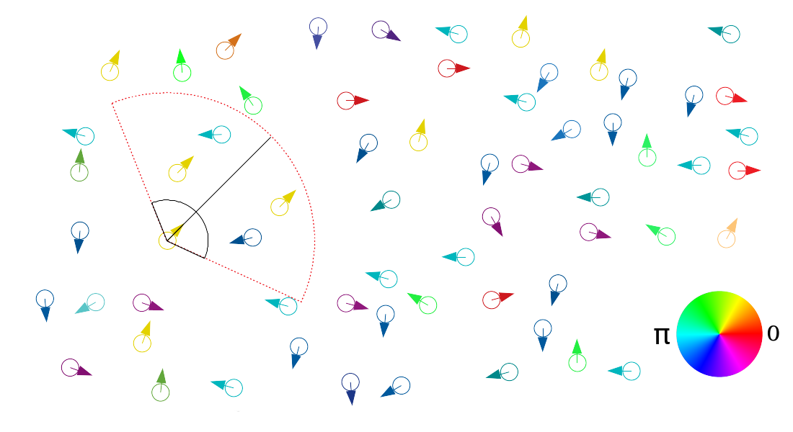
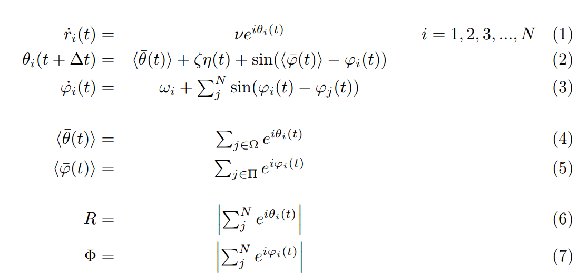

 
# Welcome to PSDAMSSPS's GitHub Page

#### PSDAMSSPS : Phase Synchronization in a Dry Active Matter System of Self-Propelled Swimmers 

This Code is a primary version of my master project in the soft condenced matter Physics.

Our main objective is introducing the phase as a new freedom degree in a dry active matter system. the best mathematical model to describe a active matter system is [Vicsek model](https://en.wikipedia.org/wiki/Vicsek_model). There are diverse examples to show active matter system in nature such as birds swarming, cattle flocking, etc. 
The Vicsek's model is very simple to show active matter and also, is very applicable. The phase transition and its order is the most significant part of this model. One of the most famous examples of active matter is the Chlamydomonas algea swarming.

Recently, in the bioPhysics science, it has been shown the flagella of each algea are synchronized after enough time. we suppose the phase difference value between each pair flagella has a oscillation behavior and this oscillator has a internal angular frequency. On the other hand, the felagella's motion of a group algea has a syncronized rhythm. 

we introduce this phase difference as a freedom degree in the spatial equations of swimmer's motion so that is effective in the swimmer's orientation, we get the sine function of the ith phase's swimmer with the local phase order parameter. there is a interaction radius to define the distance of neibourhood. we use the [Kuramoto model](https://en.wikipedia.org/wiki/Kuramoto_model) to iilustrate the tiem evolution of swimmer's phase. 

Moreover, we define viewfield for each swimmer.

<p align="center">
  
</p>

### mathmatical formula

<p align="center">
  
</p>

at the above formula $r$ is the spatial position of ith siwmmer and $\theta$ is the ith swimmer's orientation also we illustrate the ith swimmer's phase with $\varphi$ symbol. $\zeta$ is the noise strength from 0 to 1, and $\eta(t)$ is a uniform distribution at the range $-pi$ to $pi$. $\langle\bar{\varphi}\rangle$ is the local phase order parameter at the kuramoto interaction radius and $\langle\bar{\theta}\rangle$ is the local orientation order parameter at the vicsek interaction radius.
tht two last formula is the orientation and phase order parameter respectively.
when the order parameter is near 0, that means the values of elements are distributed randomly, therefore there is no orientation and phase aligment in our system but if the order parameter be near 1, the interpretation of this result is the phase or orientation alignment. 
So, you can find more info. about the two above models and other applied concepts in this tutorial at the [Google](www.google.com)


# Some note about the package
To run the package you have to install [MPICH](https://www.mpich.org/) package, also you should switch on C++11. to switch on C++11; it is enough your C++ compiler's version be greater than 4.7. 

For now you can compile the package by using the following syntax in the command.
```
mpic++ -std=c++11 ./include/*.h ./source/*.cpp -o run
```
do not forget you have to create the output and input directory into master directory of the package. also you need a file into input directory to store the initial values. you can type the values like the following:
1. number of swimmers
2. height
3. width
4. total time (500 sec)
5. noise strength
6. coupling strength
7. interval time (0.01 sec)
8. mean of distro.
9. variance of distro.
10. orientation interaction radius
11. phase interaction radius
12. view field (30 degree)
13. epsilon (coefficient of sine fucntion in the time evolution expreesion)
14. velocity of swimmers

you can run the code by using the follwoing commnad in terminal
```
mpirun -np X ./run Y Z
```

X is number of process that is related to the mpich package
Y is a boolean element, if it is 0 
